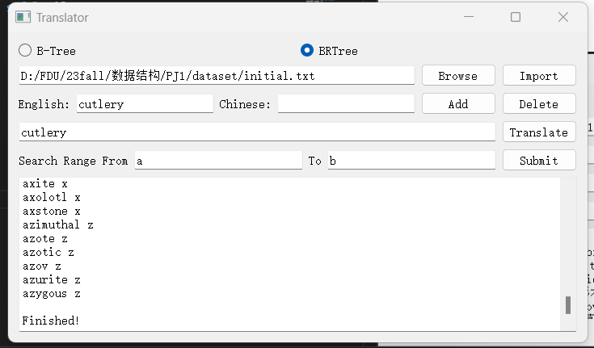

#PJ1--Translator
## （ Second commit） 
##第三方库
PyQt5--->用于ui
##使用说明
安装第三方库后，直接运行 **luncher.py** 即可运行ui
 **analysistest.py** ,是一个简单测试脚本，测试其在import三个文件的效率 多次运行后 去均值 计入csv文件
##Analysis
基于多次测试后，结果存储于data-B.csv data-BR.csv
|type| initilize | delete | insert |
|------------|----------|----------|----------|
|b| 0.01282569999966654|0.00036980000004405156|0.0003921999996236991|
|br|0.011048899999877904|0.00025040000036824495|0.0002488000000084867  |


由上方数据可知，红黑树在测试样例中总体效率更高

原因分析：
* B树和红黑树的各项操作复杂度均为O(lg n),难以从数量级角度分析
* 从应用上说，红黑树更多用于内存中的数据结构，而b树则更多用于磁盘数据库等大规模数据存储单位中，红黑树更适用于目前的数据规模
* 红黑树作为二叉树，恢复平衡的操作比B树简单，更加高效
* 在3000数量级下，红黑树效率更高，因为B树的初始化操作可能涉及更多的分裂和合并操作，这可能导致在初始化时B树比红黑树慢一些,在小数据量上并不占优势
* 在删除操作中，同样b树很难避免去进行各种平衡与调整，而红黑树的调整较为简单，同时当节点为红色时可以直接结束操作，更为方便
* 而在后续的insert操作中，B树的效率同第一次initialize更低了，降低的幅度大于红黑树，说明B树在数据量增大情况下，调整平衡的操作更多了（B树的寻址次数更少，仍然效率下降比红黑树快）

##UI设计
基于OOP思想，采用前后端分离的设计思路，将程序主体分为前端UI，后端两种树的Model，以及连接前后端的control
前端响应事件通过control来传递到Model，后端信息再传递回前端UI


###controller
```python
    #初始化方法
    def __init__(self):
    #当ui界面的树的类型选择发生变化调用此
    def changetype(self,n):
    #响应import按钮，将遍历结果写入树内的result，返回result
    def importfrom(self,_path):
    #响应translate按钮，返回翻译结果
    def search(self,key):
    #响应delete按钮
    def delete(self,key):
    #响应add按钮
    def add(self,key,value):
    #响应submit按钮，将搜索结果树内的result，返回result
    def searchByRange(self,_from,to):
       
```
###model
为两棵树
**基本功能见 B_Tree.py BR_Tree.py**
####文档中要求的检查
B树插入检查
```python
def insert(self, k):
        if self.searchByEng(k)==None:
            return
```
B树删除检查
**B树删除，即是在先寻找，如果到了叶节点还是没有找到，会自动退出**

BR树插入检查
```python
def insert(self, keys):
        
        key=keys[0]
        value=key[1]
        if self.search(key)==self.nil:
            return
```
BR树删除检查
```PYTHON
        node_to_delete = self.search(key)
        if node_to_delete == self.nil:
            return
```
###UI


##结果展示
b树初始化

b树删除后无法查询到单词

range查询


br树初始化

br树删除

br树删除后查询

br range 查询


##缺陷
 * ui界面没有错误提示，遇到error会直接退出，时间有限未修改


