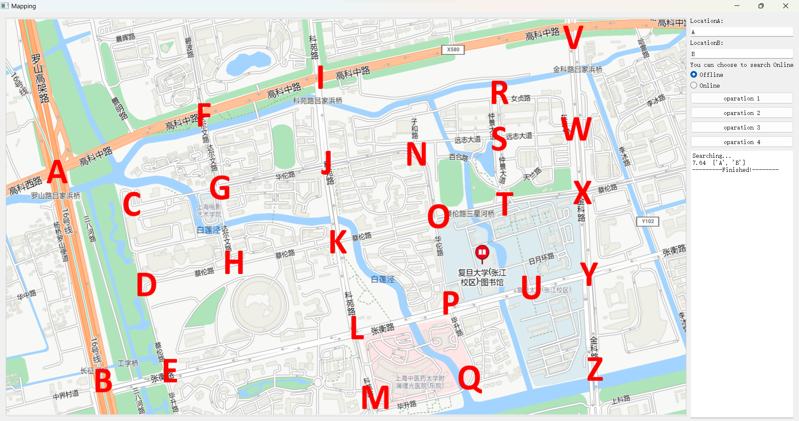
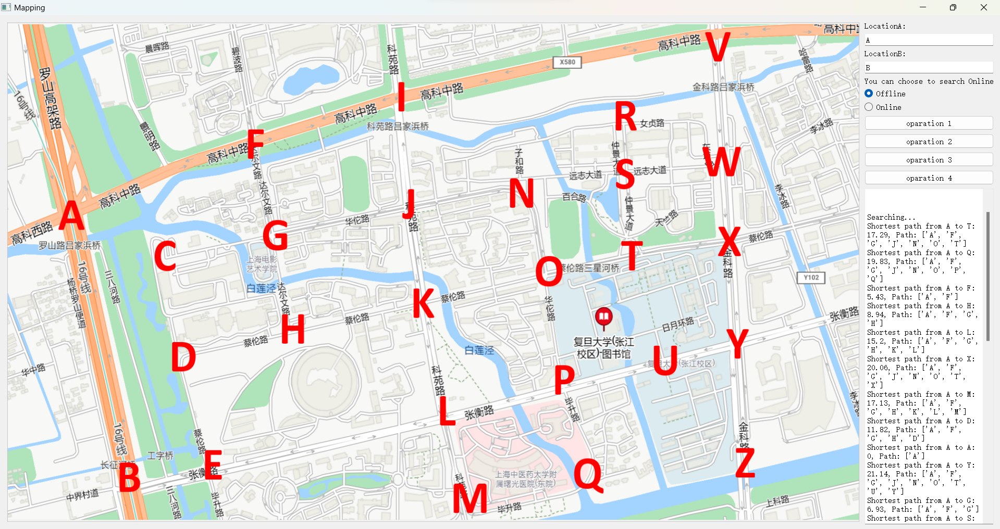
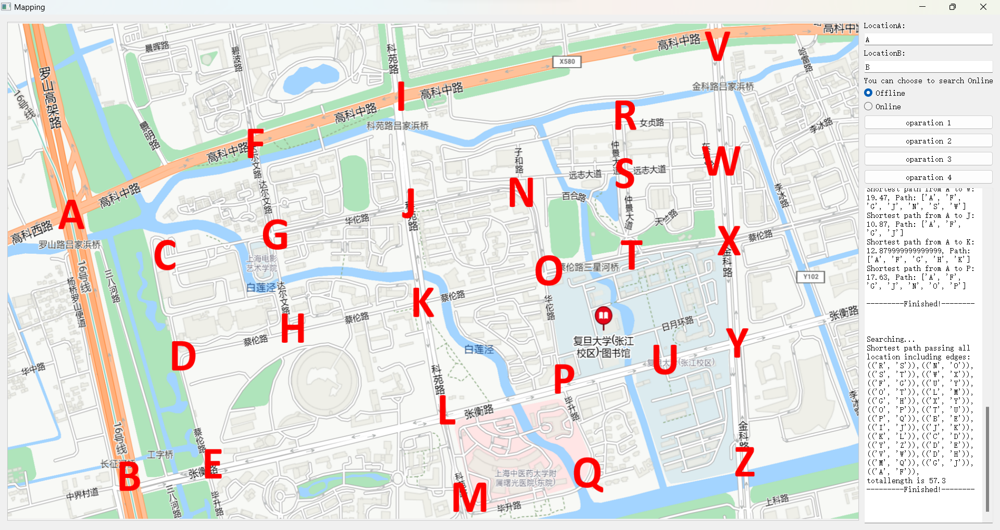
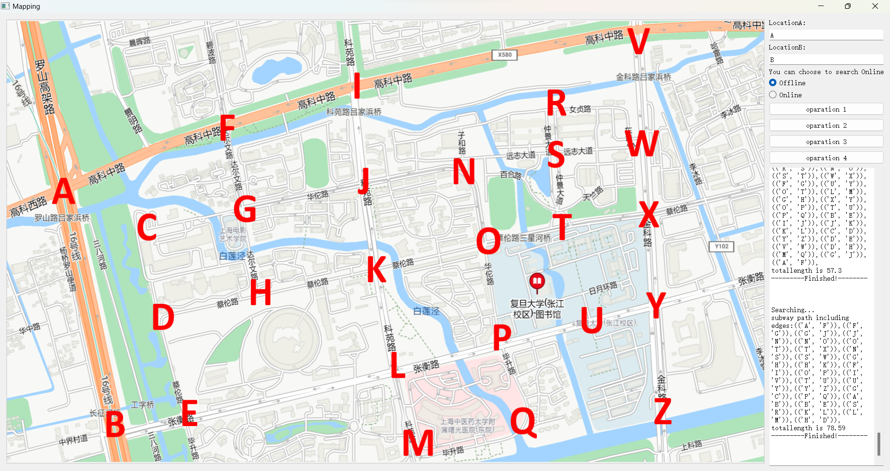
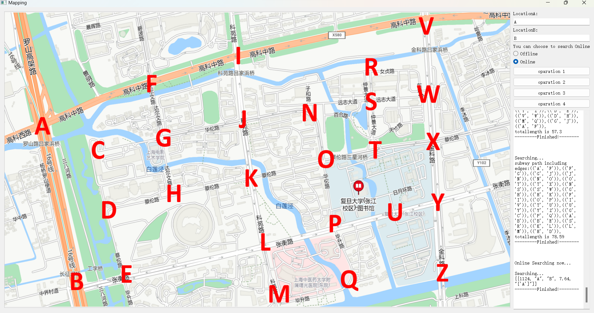

#PJ2
##Algorithm for each operation
###op1  op2
要求获取L1相关的最短路径，我们可以通过**dijkstra**，**bellman-ford**来获取以A为起点的所有最短路径，也可以通过**warshell**算法获取所有最短路径，在op1中取出到终点L2的最短路径，op2中输出L1相关所有最短路径即可

###op3
获取经过经过所有顶点的最短路，可以使用获取最小生成树的算法**kruskal** 或者**prim**算法，直接得出最小生成树包含的边

###op4
可视为不改变L1到其他任何点最短路径的路径，直接取**L1最短路径所有边的并集**，此时囊括所有最短路径，且总路径长度最短

##Introduce to project
###依赖
基于**PyQt5**搭建的UI
###功能
该项目在满足**离线查询**要求的基础上，增加了基于**python-flask**和**mysql**搭建的**在线查询 online**。我们知道，当地图足够大的时候，现场构建模型需要大量时间，我们可以在服务器上提前进行模型的构建，同时也能够更加及时的更新相关信息，用户查询时所用时间会缩短。
###UI
####offline
#####op1

#####op2

#####op3

#####op4

####online

##Analysis of algorithm
###dijkstra

对于dijkstra算法，需要建立堆来进行操作，进行**extract-min** 操作，根据结果提取出一个节点，需要对其余节点**decrease key**，T=V*T-extrct-min+E * T-decrease_key,所以其时间复杂度为O(ElgV)
###bellman-ford
对于任一最短路径最多结果n-1个结点，通过每次对边进行循环，来更新距离，所以时间复杂度为O(VE)

###warshell
对warshall算法，他先连接相邻的节点，而后循环搜索至多有两条边的最短路径，直到n-1条为止，所以时间复杂度为O(n3)

###kruskal
对于kruskal算法，主要分为两部分操作**对边排序** 和 **遍历边的查找操作**，所以在时间复杂度中起主导作用的为排序，时间复杂度为O(E lgE)

###prim
对于prim算法，需要建立堆来进行操作，进行**extract-min** 操作，根据结果连接一个节点，需要对每个节点**increase key**，T=V*T-extrct-min+E * T-increase_key,所以其时间复杂度为O(ElgV)

###合并
合并算法需要遍历所有A的最短路径，时间复杂度为 O(E)