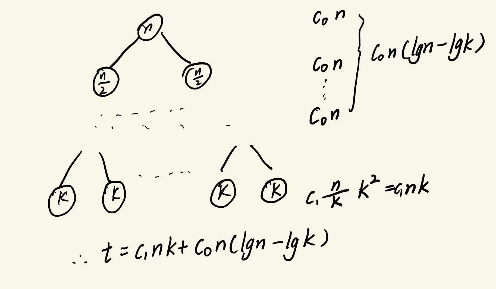
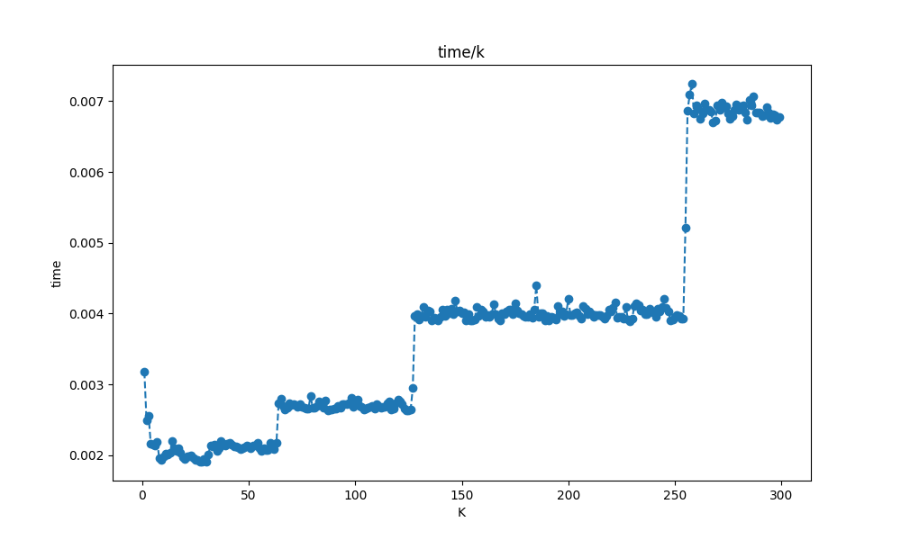
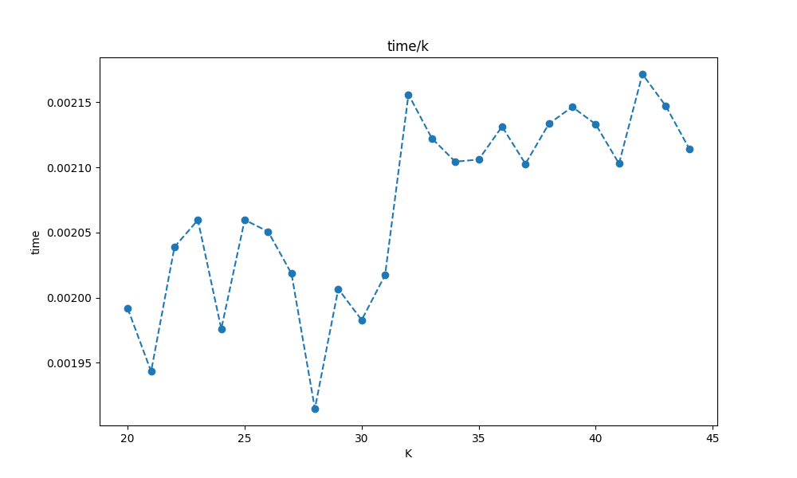
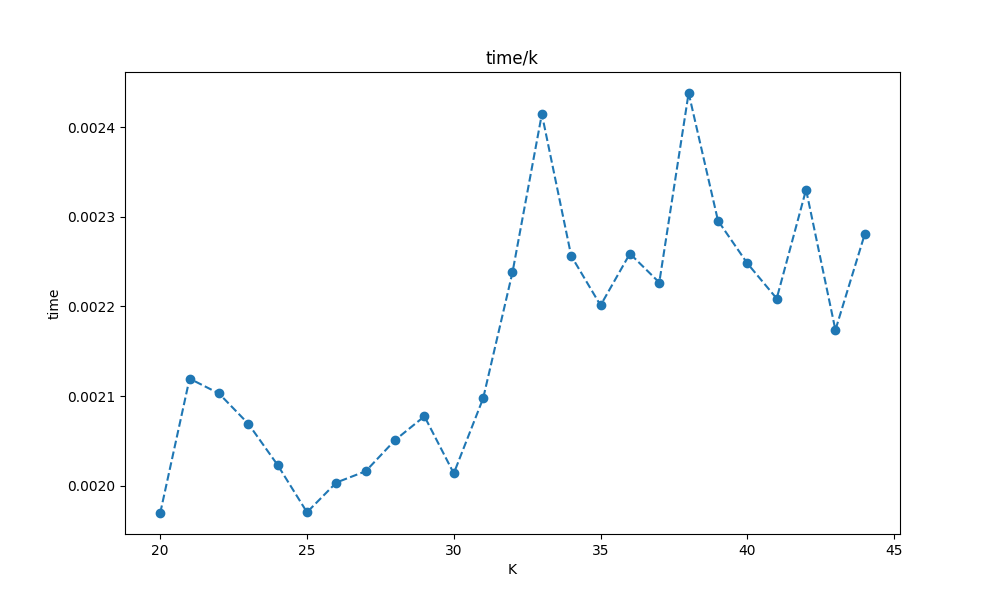

#Lab1

##Question 1
代码如下
```python
class InsertSort:
    def sort(self,source):
        for i in range(1,len(source)):
            key=source[i]
            preIndex=i-1
            while preIndex>=0 and  key<source[preIndex]:
                source[preIndex+1]=source[preIndex]
                preIndex-=1
            source[preIndex+1]=key
        return source
```
##Question 2
代码如下
```python
class MergeSort:
    def sort(self,arr):
        #拆分递归
        if len(arr)>1:
            mid=len(arr) // 2
            leftArr=arr[:mid]
            rightArr=arr[mid:]
            leftArr=self.sort(leftArr)
            rightArr=self.sort(rightArr)
        #合并
            i=0
            j=0
            k=0
            while i<len(rightArr) and j<len(leftArr):
                if rightArr[i] < leftArr [j]:
                    arr[k]=rightArr[i]
                    i+=1
                else:
                    arr[k]=leftArr[j]
                    j+=1
                k+=1
        #检查剩余元素
            while i<len(rightArr):
                arr[k]=rightArr[i]
                i+=1
                k+=1
            while j<len(leftArr):
                arr[k]=leftArr[j]
                j+=1
                k+=1
        return arr
```
##Question 3
###理论

k的最小值取决于C0 C1的大小 在对t求k偏导，当偏导等零时，其取得最优解

###实验
利用Question 4 中的ConbindedSort，生成了一个2000大小的数据集，在Test.py中从1开始遍历k，多次测试并记录时间

由图可知其最值出现在 20 - 40之间
缩小范围


经过多次实验 并且扩大每个k值的测试次数 发现k的最优解出现在25-30之间
###错误实验
####错误实验原因
未理解清楚python的传参规则，在每个k的循环中，第一次排序后，数组已经变为最优情况,使得insertsort的时间低于MergSort
####错误实验数据
**size =2000 步长为10**
 结果为

据图可知 具体最快出现在40-250区间内
**40-250**
缩小步长为3 并增大每个k值的实验次数 从40 到 250 开始遍历 结果为

**140-200**
再次缩小范围 步长缩小为1 由140 -200 进行遍历

发现时间在该区域内波动 在160到170之间存在一个相对低谷
**160-170**
多次测试后 发现时间在该区间波动，无法确定k的具体值


##Question 4
**Conbindedsort** 在MergeSort的基础上，多引入一个参数k，来作为切割数组的最大长度
```python
def sort(self,arr,k):
        #在切割到k时 停止切割
        if len(arr)>k:
            mid=len(arr) // 2
            leftArr=arr[:mid]
            rightArr=arr[mid:]
            leftArr=self.sort(self,leftArr,k)
            rightArr=self.sort(self,rightArr,k)
            ...
```
整合部分与MergeSort相同

对切割完毕的数组进行插入排序
```python
        else:
            arr=InsertSort.sort(InsertSort,arr)
```