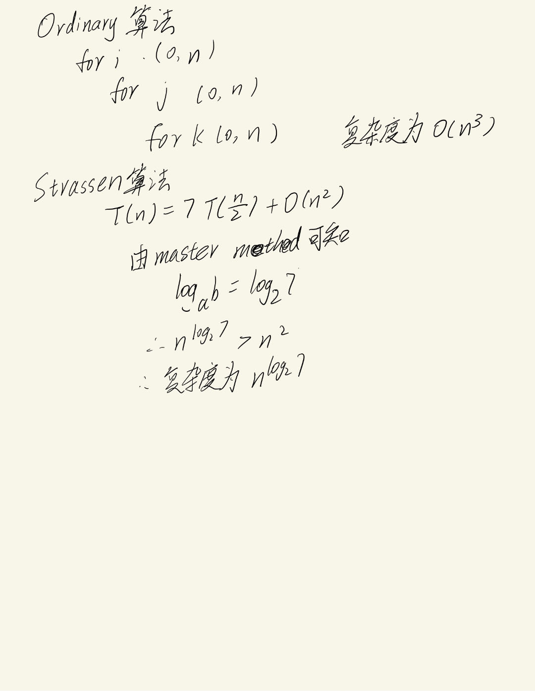
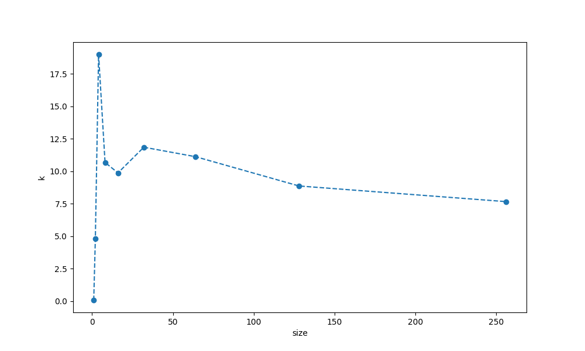
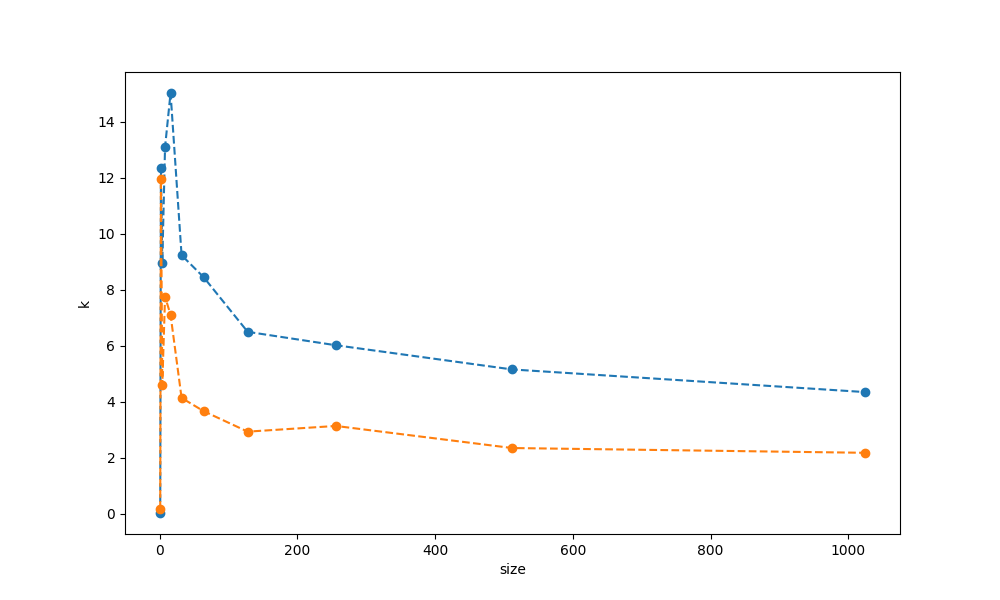
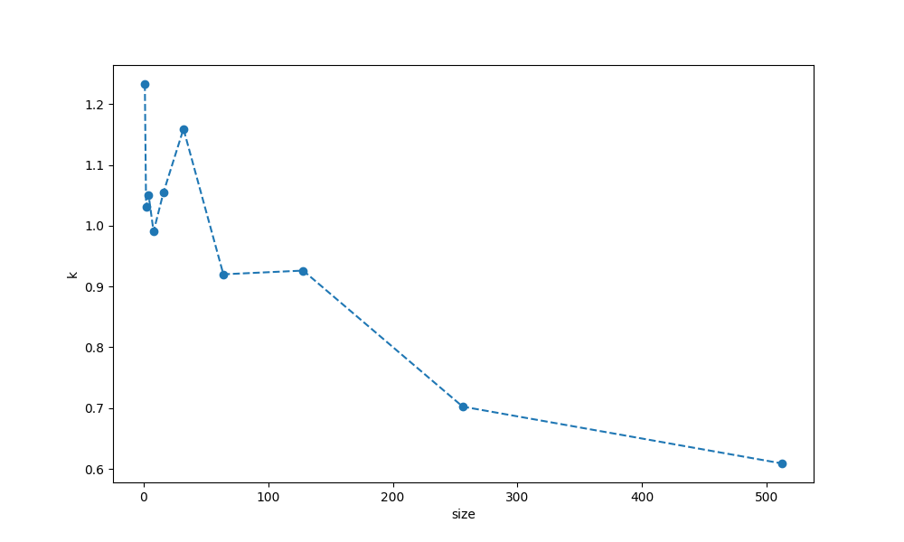

#Lab2
##Naive Way
复杂度为O(n3)
```python
     def NaiveMultiply(a,b):
        #验证乘法能否执行
        if len(a[0])!=len(b):
            print("Math error")
        else:
            result = [[0]*len(b[0]) for i in range(len(a))]
            for i in range(0,len(a)):
                for j in range(0,len(b[0])):
                    sum=0
                    for k in range(0,len(a[0])):
                        sum+=a[i][k]*b[k][j]
                    result[i][j]=sum
            return result
```
##Strassen 
使用python当中的numpy库来简化了一些操作
理论复杂度O=(N2.87)
###Version 1
``` python
if len(Matrix1[0])!=len(Matrix2):
            print("Math error")
        
        else:
            N=len(Matrix1)
            
            if(N>1):
                result = np.zeros((N,N))
                n=(int)(N/2)
                #切割矩阵
                a=Matrix1[:n,:n]
                b=Matrix1[:n,n:]
                c=Matrix1[n:,:n]
                d=Matrix1[n:,n:]
                e=Matrix2[:n,:n]
                f=Matrix2[:n,n:]
                g=Matrix2[n:,:n]
                h=Matrix2[n:,n:]    
                #递归计算
                P1=self.StrassenMultiply(self,a,self.Matrix_Minus(f,h))
                P2=self.StrassenMultiply(self,self.Matrix_Add(a,b),h)
                P3=self.StrassenMultiply(self,self.Matrix_Add(c,d),e)
                P4=self.StrassenMultiply(self,d,self.Matrix_Minus(g,e))
                P5=self.StrassenMultiply(self,self.Matrix_Add(a,d),self.Matrix_Add(e,h))
                P6=self.StrassenMultiply(self,self.Matrix_Minus(b,d),self.Matrix_Add(g,h))
                P7=self.StrassenMultiply(self,self.Matrix_Minus(a,c),self.Matrix_Add(e,f))

                R=self.Matrix_Minus(self.Matrix_Add(self.Matrix_Add(P4,P5),P6),P2)
                S=self.Matrix_Add(P1,P2)
                T=self.Matrix_Add(P3,P4)
                U=self.Matrix_Minus(self.Matrix_Minus(self.Matrix_Add(P1,P5),P3),P7)

                result1 = np.concatenate((R, S), axis=1)
                result2= np.concatenate((T, U), axis=1)
                result =np.concatenate((result1,result2),axis=0)
                return result
            else:
                return np.array([[Matrix1[0][0]*Matrix2[0][0]]])
```
##理论

##实验过程
###首次测试
使用原版代码测试，发现与Naive Way 差距太大，虽然比值一直在缩小，但仍然没办法超过
图中曲线为 **average_time_strassen/verage_time_naive**（两种算法的时间比值） 随**size**的变化呈现的变化 
在数据量不断变大的过程中，该比值不断缩小，即strassen算法的时间在不断迫近原始算法，但由于达到相等时需要的数据量过大无法测出

###改进代码再次测试
使用chatgpt改进代码后，重新测试
效率较原本的strassen算法更快，但在1024*1024大小矩阵时，仍然未超过原始算法
PS:图中橙色为改进后代码

###分析原因
在运行过程中，切割矩阵时总是需要copy一份
```python
 # 分割输入矩阵为四个子矩阵
        n = len(A)
        n_half = n // 2
        A11 = A[:n_half, :n_half]
        A12 = A[:n_half, n_half:]
        A21 = A[n_half:, :n_half]
        A22 = A[n_half:, n_half:]
        
        B11 = B[:n_half, :n_half]
        B12 = B[:n_half, n_half:]
        B21 = B[n_half:, :n_half]
        B22 = B[n_half:, n_half:]
```
每次计算的结果也都需要重新开一个数组来存储
```python
    def Matrix_Add(a,b):
        n=len(a)
        
        result = np.zeros((n,n))
        for i in range(0,n):
            for j in range(0,n):
                result[i][j]=a[i][j]+b[i][j]
        return result

    def Matrix_Minus(a,b):
        n=len(a)
        
        result = np.zeros((n,n))
        for i in range(0,n):
            for j in range(0,n):
                result[i][j]=a[i][j]-b[i][j]
        return result
```
消耗过高，导致结果始终不能超过最快算法

##改进方法
**Conbinded Way**
在切割到一定大小后 直接使用原始算法来加快计算
```python
if len(A) <= 32:
            return Matirx.NaiveMultiply(A,B)
```
###测试结果

在size=64 时其就超越了原始算法