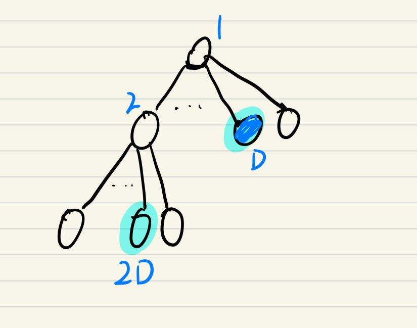
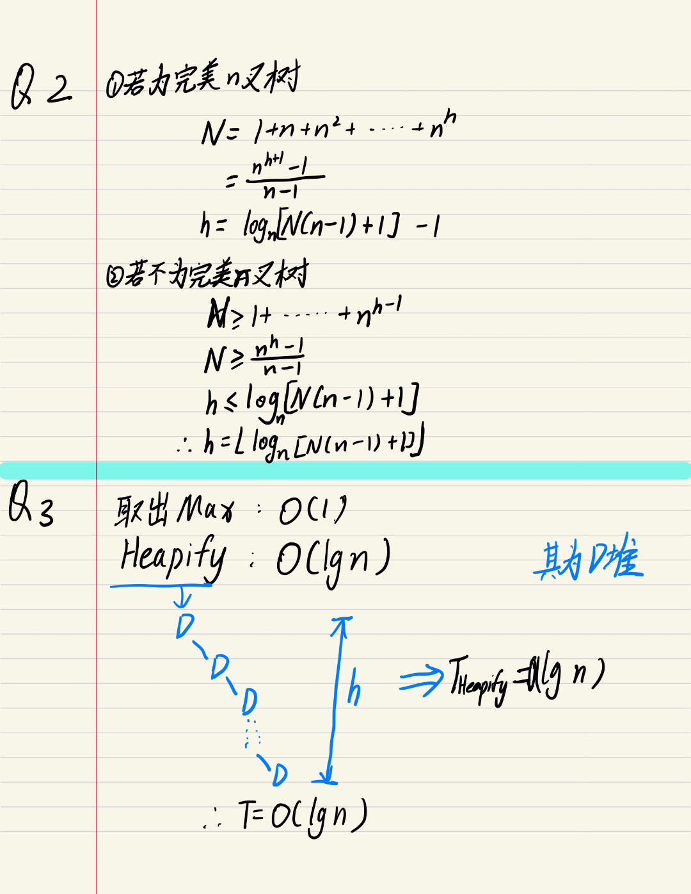
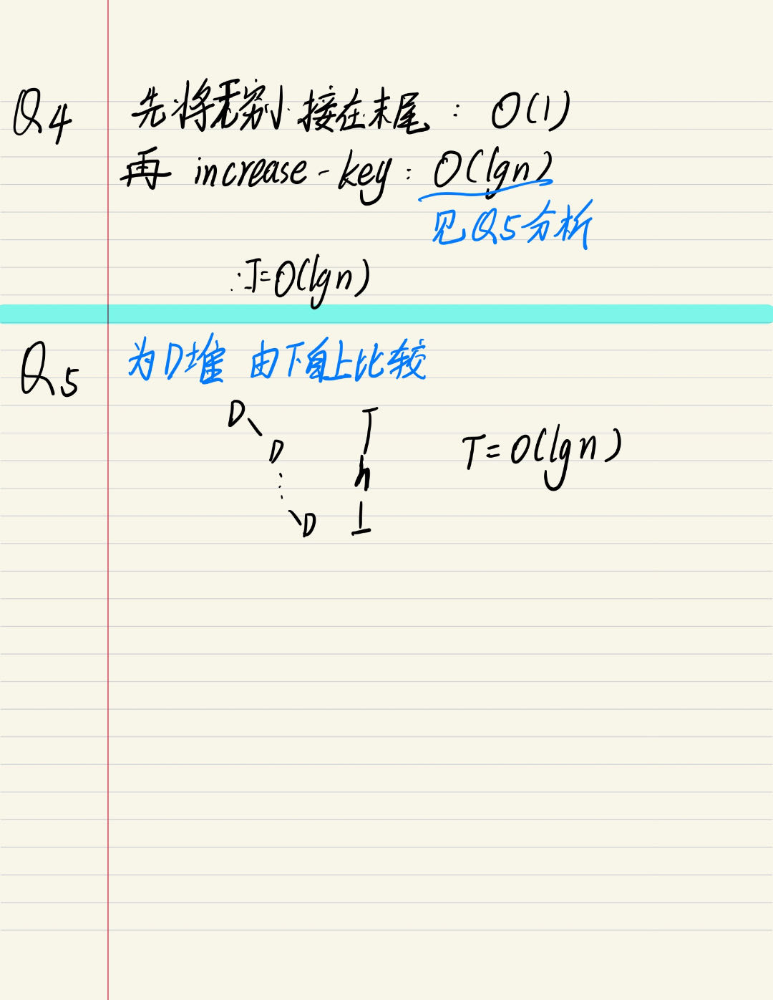

#Lab4
##Q1
无论D为何值，index\*D为该点倒二个子节点的下标
由此我们可知如果要计算一个节点的 **父节点**，可使用公式 **[(index+D-2)/D]** 
如果计算 一个节点的**子节点**，子节点范围应该在 **index*D-D+2** 到 **index\*D+1**

##Q2
答案 分析见末尾图片
##Q3
对于最大堆而言，无论D大小以及N大小，他的最大值始终在根节点，所以需要提取根节点数据,在进行Heapify操作，时间复杂度为**O(lgn)**
```python
    def ExtractMax(self):
        max=self.HeapArray[1]
        self.HeapArray[1]=self.HeapArray[self.size]
        self.size-=1
        self.Heapifyall()
        return max
```
分析见末尾图片
##Q4
```python
def Insert(self,key):
        index=len(self.D)
        #插入一个小值
        self.HeapArray.append(0)
        #增大其值
        self.IncreaseKey(self,index,key)
```
分析见末尾图片 T=O(lg n)
##Q5
```python
 def IncreaseKey(self,index,key):
        D=self.D
        #检查
        if self.HeapArray[index]>key:
            print("error")
        else:
            #与父节点比较，直到父节点大于本身 或者 达到根节点位
            self.HeapArray[index]=key
            while(self.HeapArray[index]>self.HeapArray[int((index+D-2)/D)] and index>0):
                self.HeapArray[index],self.HeapArray[int((index+D-2)/D)]=self.HeapArray[int((index+D-2)/D)],self.HeapArray[index]
                index=int((index+D-2)/D)
            print("successful increasing")

```
分析见末尾图片 T=O(lg n)

##Q5
```python
#建好数组 0是为了方便下标与树节点的标记对应做出的调整 并不对0进行任何操作
a=[0]+[1, 2, 3, 4, 5, 6, 7, 8, 9, 10, 11, 12, 13, 14, 15, 16, 17, 18, 19, 20, 21, 22, 23, 24, 25, 26, 27, 28, 29, 30]
heap=DHeap(3,a)

heap.Heapifyall()
print(heap.HeapArray)
heap.ExtractMax()
print(heap.HeapArray)
#重置数组
heap.HeapArray=[0]+[1, 2, 3, 4, 5, 6, 7, 8, 9, 10, 11, 12, 13, 14, 15, 16, 17, 18, 19, 20, 21, 22, 23, 24, 25, 26, 27, 28, 29, 30]
heap.size+=1
heap.Heapifyall()
heap.IncreaseKey(10,28)

print(heap.HeapArray)
```

结果为
 **
[0, 30, 22, 29, 13, 16, 19, 21, 25, 28, 10, 11, 12, 4, 14, 15, 5, 17, 18, 6, 20, 2, 7, 23, 24, 8, 26, 27, 9, 3, 1]
[0, 29, 22, 28, 13, 16, 19, 21, 25, 27, 10, 11, 12, 4, 14, 15, 5, 17, 18, 6, 20, 2, 7, 23, 24, 8, 26, 1, 9, 3, 1]
[0, 30, 22, 29, 13, 16, 19, 21, 25, 28, 28, 11, 12, 4, 14, 15, 5, 17, 18, 6, 20, 2, 7, 23, 24, 8, 26, 27, 9, 3, 1]
**
PS:0无任何作用，只是为了垫个坐标


##分析

